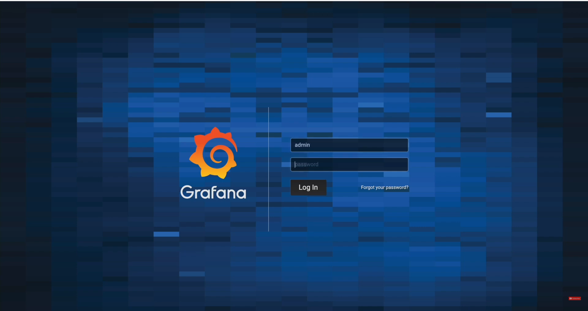
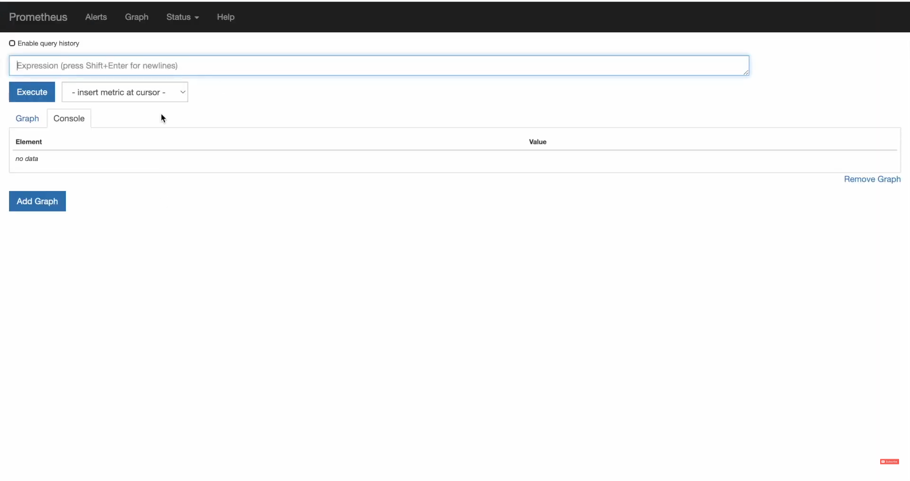
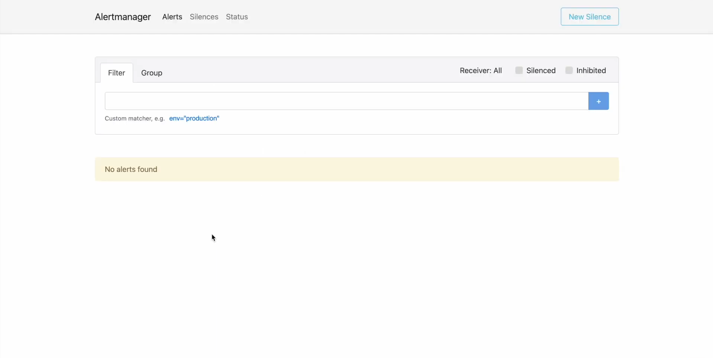

Ansible Monitoring Stack

An Ansible-based Monitoring Stack project designed to automate the deployment and configuration of Grafana, Prometheus, Prometheus Node Exporter, and Alertmanager across a set of nodes. This repository aims to simplify infrastructure monitoring using a reliable and scalable solution.

Project Overview

This project automates the installation and configuration of a complete monitoring stack using Ansible. It includes the setup of:

- Grafana for visualizing metrics.
- Prometheus for scraping and storing time-series data.
- Prometheus Node Exporter for gathering system-level metrics.
- Alertmanager for handling alerts and notifications.

With this setup, users can monitor their systems, get real-time insights into performance, and receive timely alerts for critical events. The goal of this project is to make it easy to deploy a full monitoring stack in any environment using Ansible.

Prerequisites

Before running the playbook, ensure the following prerequisites are in place:

-   Ansible installed on the control node (master).
-   SSH access to target (slave) nodes with appropriate permissions.
-   Sudo privileges for the user running Ansible on target nodes.
-   Supported operating systems:
      - Ubuntu 20.04 or later (recommended).
      - CentOS 7 or later (for RedHat-based systems).

Installation on Control Node (Master) :-
```
sudo apt update
sudo apt install ansible -y
```
Clone this repository:
```
    git clone https://github.com/PiyushN-24/Ansible-Monitoring-Stack.git
    cd Ansible-Monitoring-Stack
```

Installation on Target Nodes (Slaves) :-

Ensure the target nodes are accessible via SSH and have the necessary dependencies installed (Python and Ansible requirements).

Project Structure

Here’s a quick overview of the project’s directory structure:
```
.
├── ansible.cfg             # Configuration for Ansible
├── inventory               # Hosts and groups defined for target nodes
├── playbook.yml            # Main Ansible playbook
└── roles                   # Directory containing roles for each tool
    ├── grafana
    ├── prometheus
    ├── prometheus_node_exporter
    └── alertmanager
```
Key Files:
- ansible.cfg: Configuration file for Ansible settings.
- inventory: Defines the target hosts (master and slave nodes).
- playbook.yml: Main playbook that orchestrates the setup of the monitoring stack.
- Roles Directory: Contains individual Ansible roles for each monitoring tool (Grafana, Prometheus, etc.).

Configuration

Editing the Inventory
Update the inventory file with your target nodes. The inventory defines the group of nodes (master and slave nodes) where the monitoring stack will be deployed.

Example:
```
[prometheus]
13.127.66.77

[node_exporter]
13.127.66.77

[alertmanager]
13.127.66.77

[grafana]
13.127.66.77
```
You can also modify the ansible.cfg file to set the default connection parameters, such as SSH user, SSH keys, and so on.

Tools/Components Used 

1) Grafana
Grafana is an open-source platform for monitoring and observability. It allows you to visualize time-series data from Prometheus through customizable dashboards.
- Port: 3000 (default).
- Usage: After installation, navigate to http://<GRAFANA_IP>:3000 to access the web interface. The default login is admin/admin.


2) Prometheus
Prometheus is an open-source monitoring and alerting toolkit used for collecting and storing metrics as time-series data. Prometheus scrapes metrics exposed by various targets (e.g., Node Exporter).
- Port: 9090 (default).
- Usage: After installation, navigate to http://<PROMETHEUS_IP>:9090 to access the web interface.


3) Prometheus Node Exporter
The Prometheus Node Exporter exposes hardware and OS metrics, such as CPU, memory, disk usage, and network statistics, making them available to Prometheus for collection.
- Port: 9100 (default).


4) Alertmanager
Alertmanager handles alerts sent by Prometheus and manages notifications. You can configure it to send alerts to Slack, email, or other communication channels.
- Port: 9093 (default).
- Usage: Navigate to http://<ALERTMANAGER_IP>:9093 to view alert configurations.


Usage Examples 

To deploy the entire monitoring stack, Run the Ansible playbook to deploy Grafana, Prometheus, Node Exporter, and Alertmanager:
```
ansible-playbook playbook.yml
```
After the playbook completes, verify the services on each node:
-   Grafana: http://<GRAFANA_IP>:3000
-   Prometheus: http://<PROMETHEUS_IP>:9090
-   Node Exporter: http://<NODE_EXPORTER_IP>:9100
-   Alertmanager: http://<ALERTMANAGER_IP>:9093

Conclusion

This Ansible-based monitoring stack provides a comprehensive solution for monitoring your infrastructure. With the combination of Grafana, Prometheus, Prometheus Node Exporter, and Alertmanager, users can easily visualize performance metrics, monitor system health, and receive timely alerts.